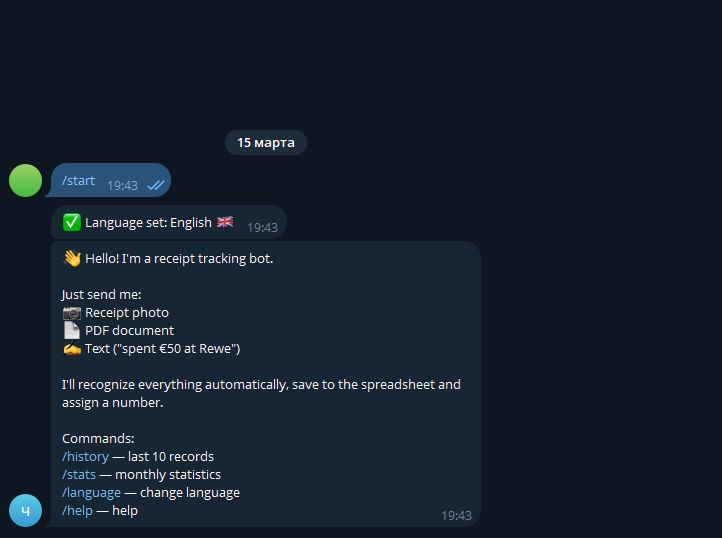
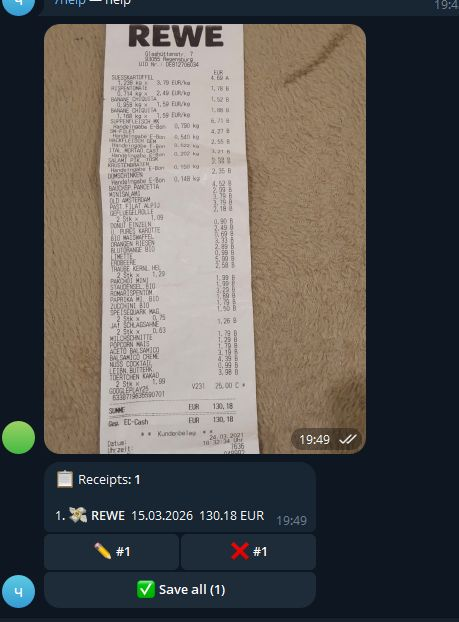
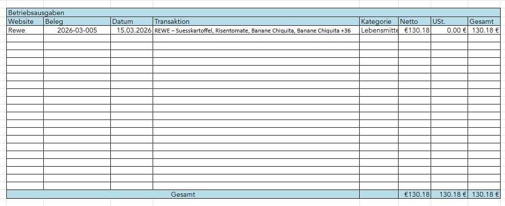
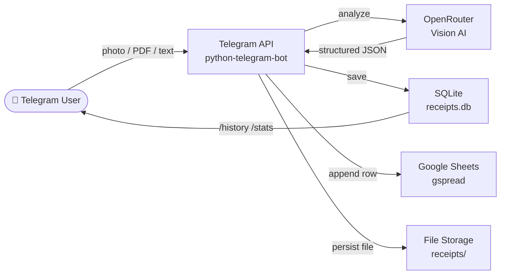

# Receipt Bot 🧾

> A production-ready Telegram bot that turns receipt photos, PDFs, and text into structured financial records — powered by AI vision models, stored in SQLite, and synced to Google Sheets in real time.


---

## Screenshots

| Receipt card | Batch confirmation | Statistics |
|---|---|---|
|  |  |  |

---

## Features

- 📷 **Receipt recognition** — send a photo, PDF, or plain text; the AI extracts store, date, amount, VAT, and line items automatically
- 🤖 **Vision AI** — uses OpenRouter free-tier vision models (Gemma, Nemotron, Mistral) with automatic fallback and rate-limit handling
- 📊 **Google Sheets sync** — writes every transaction to a monthly EÜR spreadsheet, sorted by date
- 🗃️ **SQLite storage** — all receipts stored locally with atomic numbering (`YYYY-MM-NNN`) and WAL mode
- 📦 **Batch processing** — send multiple receipts at once; the bot queues them, processes in parallel, and lets you review/edit/cancel each one before saving
- ✏️ **Inline editing** — tap any field (store, amount, date, category…) to correct it before saving
- 📈 **Stats & history** — `/stats` shows monthly income/expense breakdown by category; `/history` lists recent records with filters
- 🌐 **Multi-language** — Russian 🇷🇺, German 🇩🇪, English 🇬🇧 — each user picks their language via `/language`
- 🔒 **Access control** — whitelist of Telegram user IDs; all other users are rejected
- 🛡️ **Security hardened** — path traversal protection, magic-byte file validation, per-user rate limiting, AI semaphore, input sanitization

---

## Architecture



---

## Quick Start

### Prerequisites

- Python 3.12+
- A Telegram bot token from [@BotFather](https://t.me/BotFather)
- An [OpenRouter](https://openrouter.ai) API key (free tier works)
- A Google Cloud service account with Sheets + Drive API enabled *(optional)*

### Installation

```bash
git clone https://github.com/ArseniiB-o/receipt-bot.git
cd receipt-bot
python -m venv .venv
source .venv/bin/activate      # Windows: .venv\Scripts\activate
pip install -r requirements.txt
```

### Configuration

```bash
cp .env.example .env
# Fill in your credentials
```

See the [Configuration Reference](#configuration-reference) table below for all variables.

For Google Sheets, place your service account JSON at the path set in `GOOGLE_SERVICE_ACCOUNT_JSON` and share the spreadsheet with the service account email.

### Running

```bash
python main.py
# or
./start.sh      # Linux/macOS
start.bat       # Windows
```

---

## Project Structure

```
receipt-bot/
├── main.py                  # Entry point — bot setup, handler registration, auth decorator
├── config.py                # Loads and validates all .env variables
├── models.py                # Receipt and ReceiptItem dataclasses
├── database.py              # SQLite layer — init, atomic save, queries, user settings
├── ai_processor.py          # OpenRouter API — image/text analysis, fallback models
├── sheets_handler.py        # Google Sheets writer — column auto-detection, sorted insert
├── file_manager.py          # File download, rename, path traversal guard
├── utils.py                 # Rate limiting, currency formatting, category emojis
├── handlers/
│   ├── i18n.py              # Translation strings (ru/de/en) and t() helper
│   ├── message_handler.py   # Handles photos, documents, voice, text, forwards
│   ├── callback_handler.py  # Inline button callbacks — save, edit, cancel, language
│   └── command_handler.py   # /start /help /history /stats /cancel /backup /language
├── requirements.txt
├── .env.example             # Template — copy to .env and fill in
├── Makefile                 # make install / run / lint / test
├── start.sh                 # Linux/macOS launcher
├── start.bat                # Windows launcher
├── CHANGELOG.md
├── LICENSE
└── docs/
    └── SECURITY.md
```

---

## Configuration Reference

| Variable | Required | Default | Description |
|---|---|---|---|
| `TELEGRAM_BOT_TOKEN` | ✅ | — | Bot token from @BotFather |
| `OPENROUTER_API_KEY` | ✅ | — | API key from openrouter.ai |
| `ALLOWED_USER_IDS` | ✅ | — | Comma-separated Telegram user IDs allowed to use the bot |
| `OPENROUTER_MODEL` | | `nvidia/nemotron-nano-12b-v2-vl:free` | Primary vision model |
| `GOOGLE_SHEETS_ID` | | *(empty)* | Spreadsheet ID from the Google Sheets URL |
| `GOOGLE_SERVICE_ACCOUNT_JSON` | | `./service_account.json` | Path to service account credentials file |
| `ADMIN_USER_ID` | | *(empty)* | Telegram user ID allowed to use `/backup` |
| `REPO_URL` | | `https://github.com/...` | Used in OpenRouter `HTTP-Referer` header |
| `RECEIPTS_FOLDER` | | `./receipts` | Directory for permanent receipt file storage |
| `DB_PATH` | | `./receipts.db` | SQLite database file path |
| `LOG_LEVEL` | | `INFO` | Logging verbosity: `DEBUG`, `INFO`, `WARNING`, `ERROR` |
| `CONFIRMATION_REQUIRED` | | `true` | Show confirm/edit/cancel UI before saving |

---

## Commands Reference

| Command | Description |
|---|---|
| `/start` | Welcome message; shows language selector on first use |
| `/help` | Full usage guide |
| `/history [N]` | Last N receipts (default 10); filterable by all / mine |
| `/stats [month] [year]` | Monthly income/expense breakdown with category totals |
| `/cancel` | Undo the last saved receipt (within 5 minutes) |
| `/backup` | Download a zipped copy of the SQLite database (admin only) |
| `/language` | Change interface language (🇷🇺 / 🇩🇪 / 🇬🇧) |

---

## Tech Stack

| Component | Library |
|---|---|
| Telegram framework | [python-telegram-bot 22](https://python-telegram-bot.org/) |
| AI vision | [OpenRouter](https://openrouter.ai/) via [openai-python](https://github.com/openai/openai-python) |
| Google Sheets | [gspread 6](https://docs.gspread.org/) + [google-auth](https://google-auth.readthedocs.io/) |
| PDF extraction | [pdfplumber](https://github.com/jsvine/pdfplumber) |
| Database | SQLite 3 (stdlib) |
| Config | [python-dotenv](https://github.com/theskumar/python-dotenv) |

---

## Contributing

1. Fork the repository
2. Create a feature branch: `git checkout -b feat/your-feature`
3. Make your changes and run `make lint`
4. Open a pull request

---

## License

MIT — see [LICENSE](LICENSE) for details.
"# receipt-bot-ai" 
